## DEV-01, Setting up our project:
Imported some assets and reorganized them

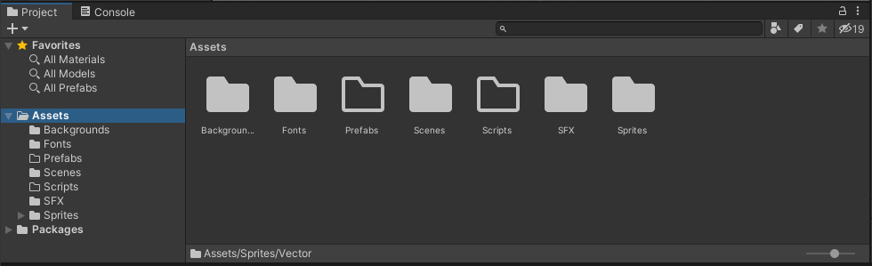
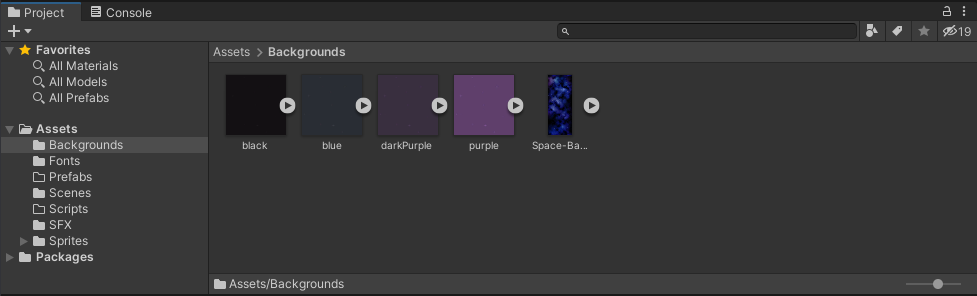
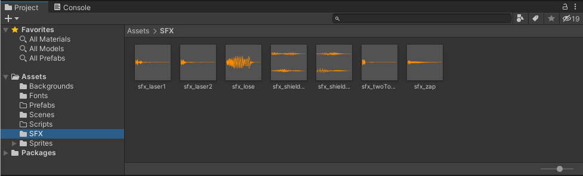
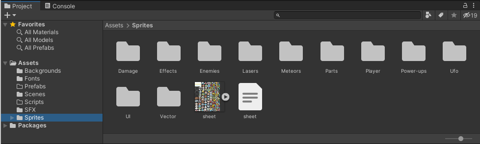
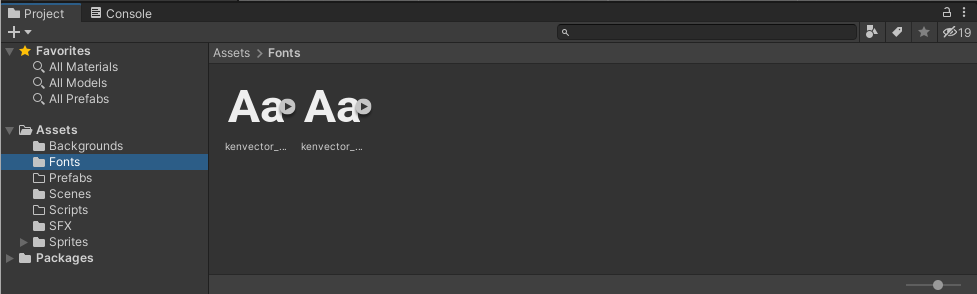

Free Assets
https://kenney.nl/assets?s=space+shooter

### Configurations

Set up your development layout as such
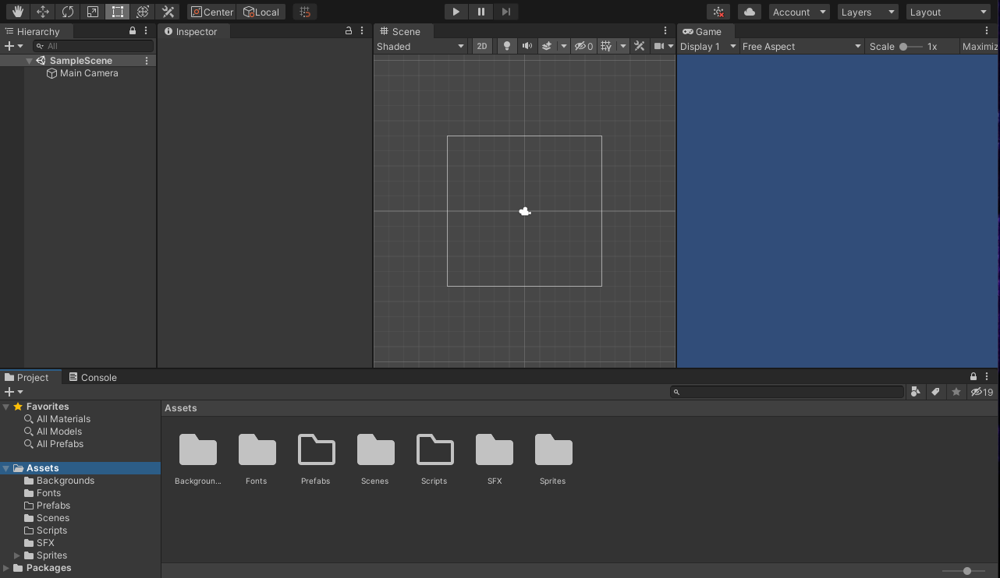

Go to the Game tab next to scene to set a 9:16 low resolution Aspect Ratio then select OK
This is great for mobile devices
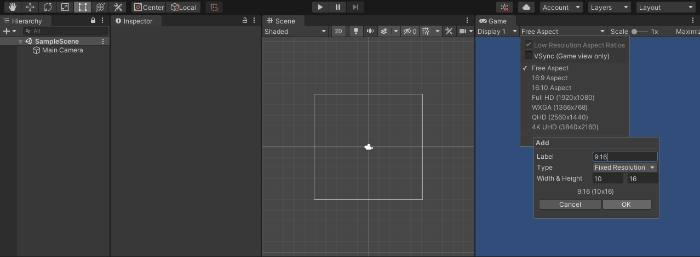

### Creating Canvas

Create a new Canvas (and Event System??) by right clicking in the Hierarchy space
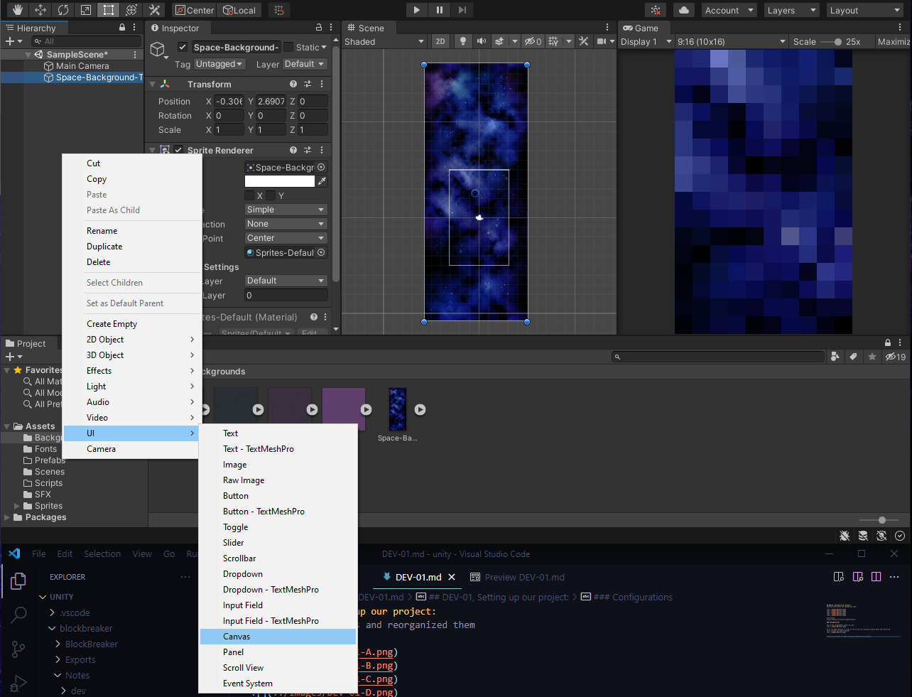

Then set the `UI Scale Mode` with `Scale With Screen Size`
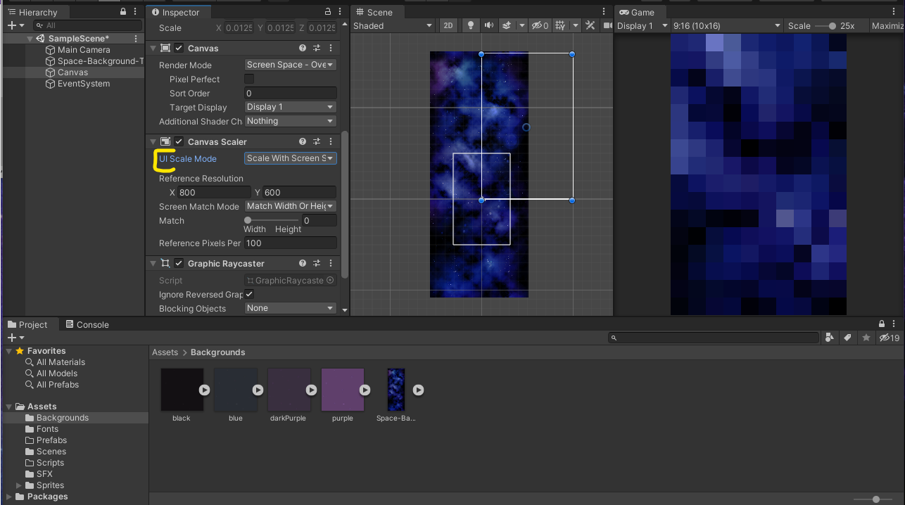

Set the `Reference Resolution` to 1080 by 1920

Created a new resolution setting since the old one kept making my background pixelated
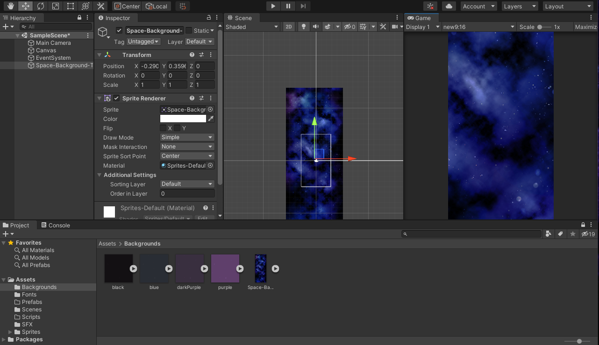

Press shift while scaling to make sure the dimensions remain fine
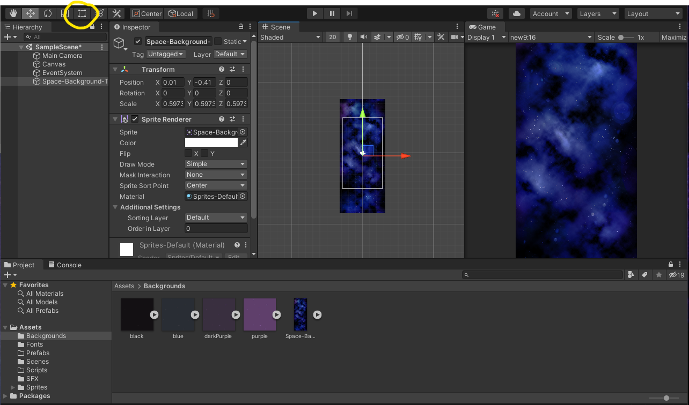

### Creating GameObject Player

In the Hieararchy, right click under `Create Empty` create a new GameObject and rename it to Player. Then reset the transform to origin positions
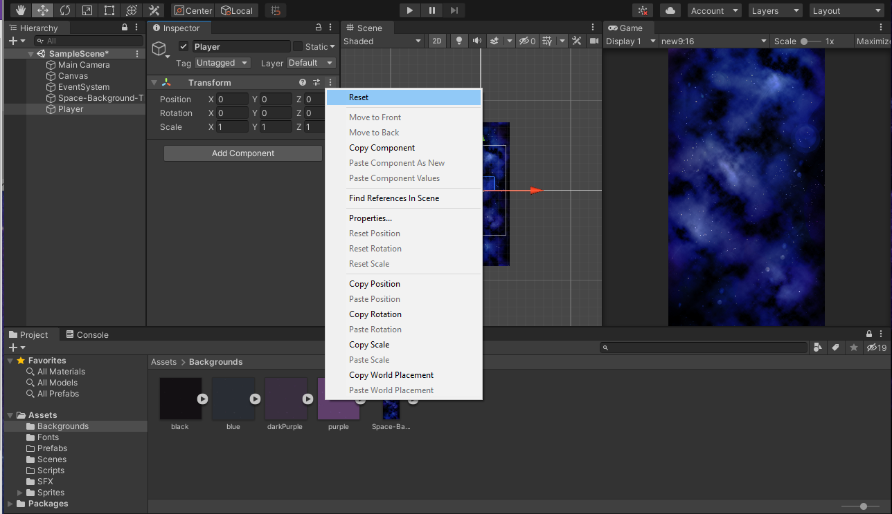

Add a `Sprite Renderer` Component in GameObject Player. Add the Player sprite in the `Sprite` property in the `Sprite Renderer`
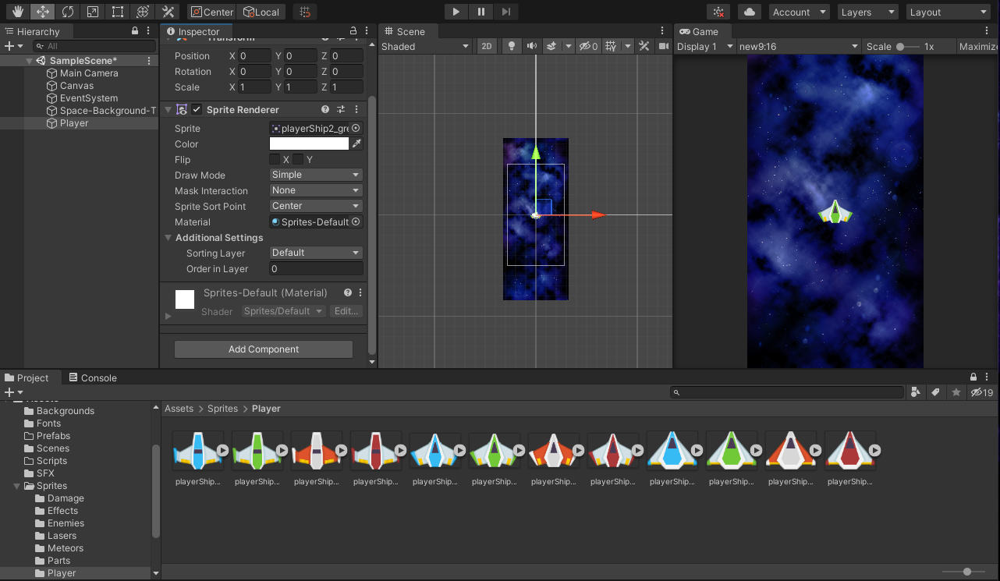

Position the Player towards the bottom of the game View

### Creating GameObject Enemy

Follow similar steps for Player

### Spatial positioning on Z

Click on the 3D button and set everything about 5 units away from eachother:
the background, the sprites and the camera

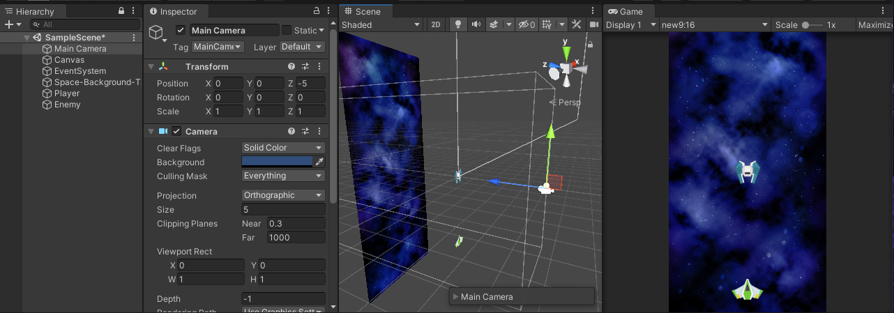

We also want to make the sprite seem 'smaller'
So set the `Main Camera`'s `Camera`'s `Size` property to 10

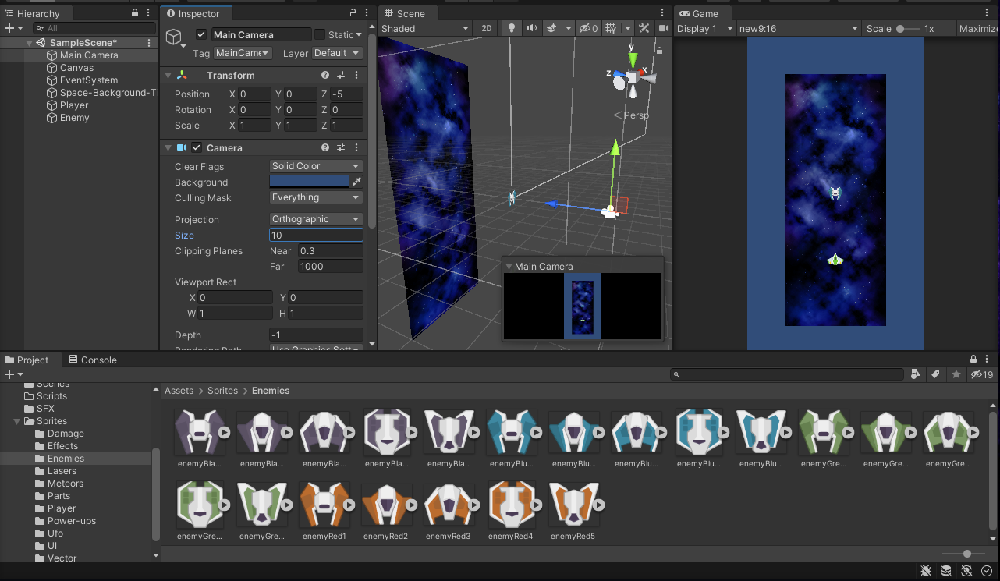

Then resize the background using shift 

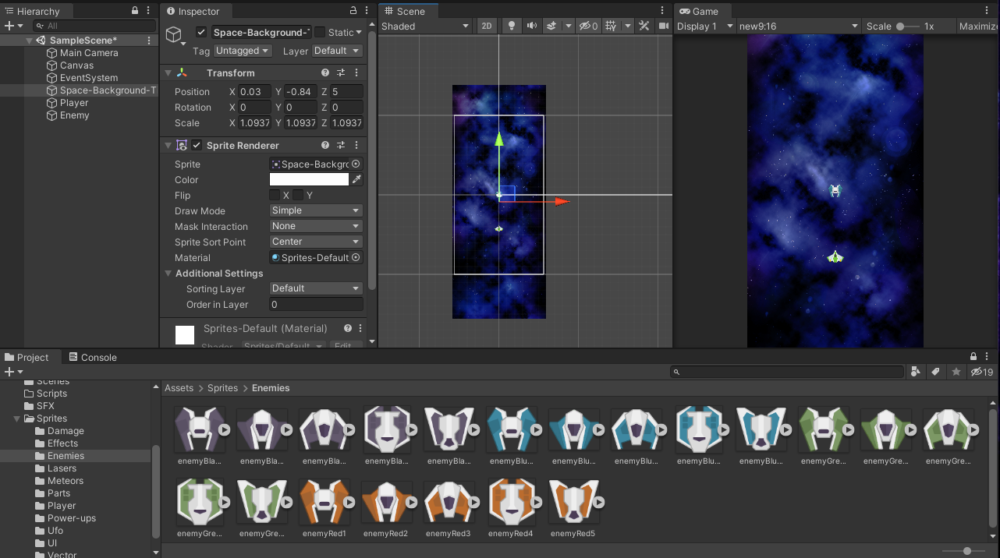