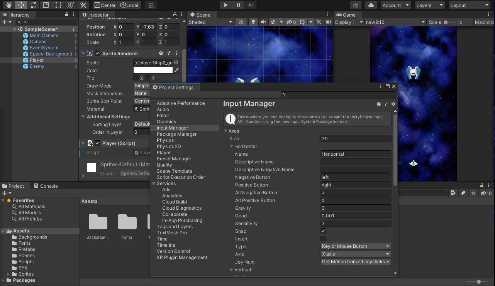
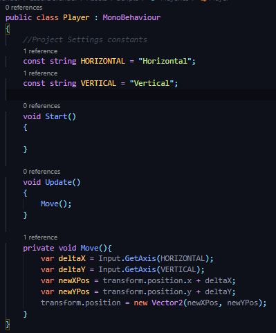
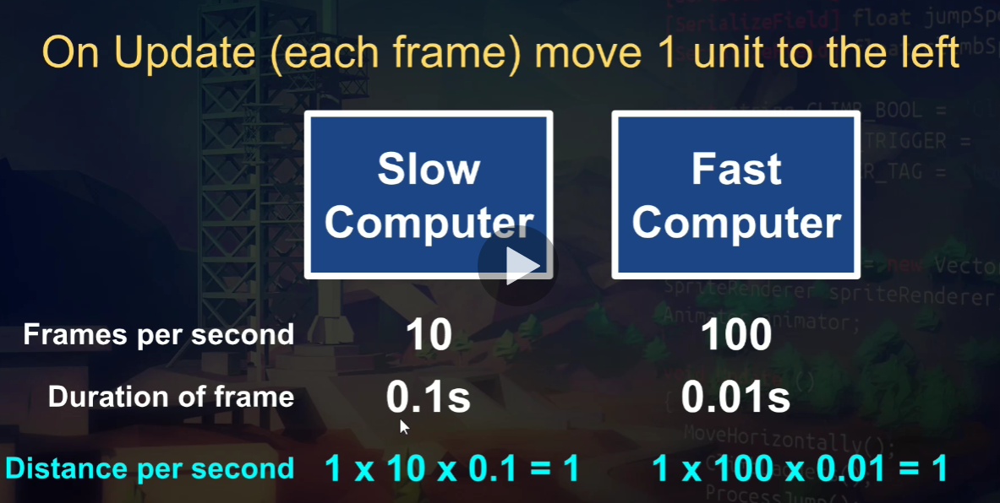
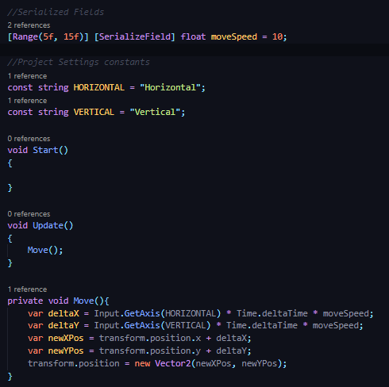

## DEV-02, Movement & Time.deltaTime:
#### Tags: [delta, time, input, framerate]

We will be making our character move in multiple directions
We will also be introducing Time.deltaTime to make our game framerate independent

### Manipulating Axis

This is an alterative to getting Key Down stuff in scripts. instead we can do this:

Edit > Project Settings > Input Manager

We are going to manipulate both the horizontal and vertical

https://docs.unity3d.com/Manual/class-InputManager.html
https://docs.unity3d.com/ScriptReference/Input.html

### Managing the speed of our Player

The player is moving too fast

the goal of Time.deltaTime is to make our game framerate independent
Using Time.deltaTime, Unity can tell us the duration each frame took to execute.
In the end the game behaves the same on both fast and slow computers

https://docs.unity3d.com/ScriptReference/Time-deltaTime.html

The player now moves smoothly and at a proper pace!