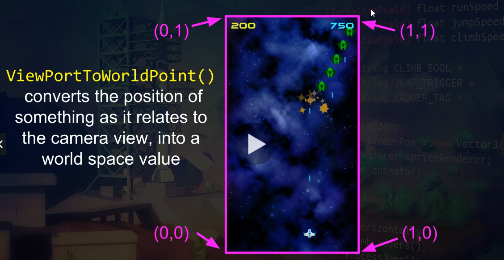
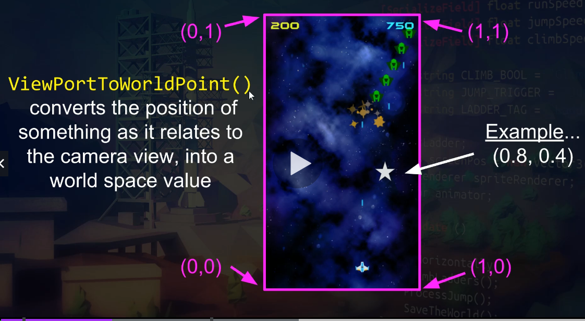
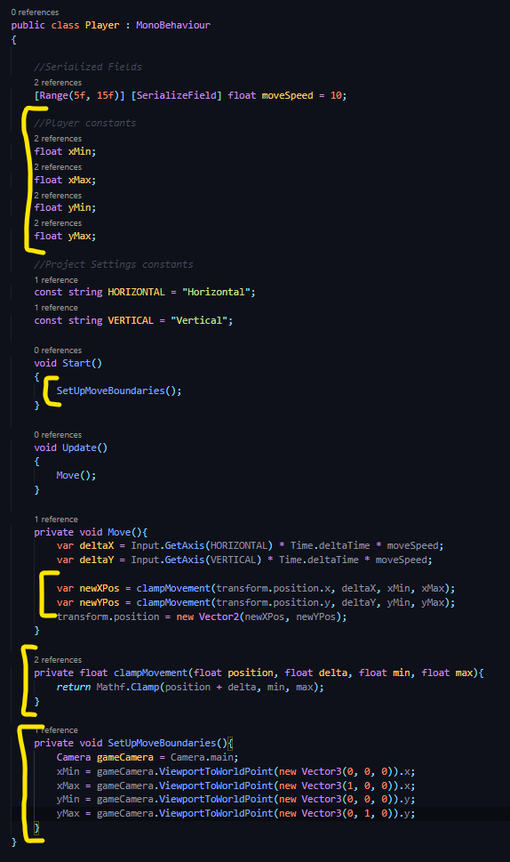
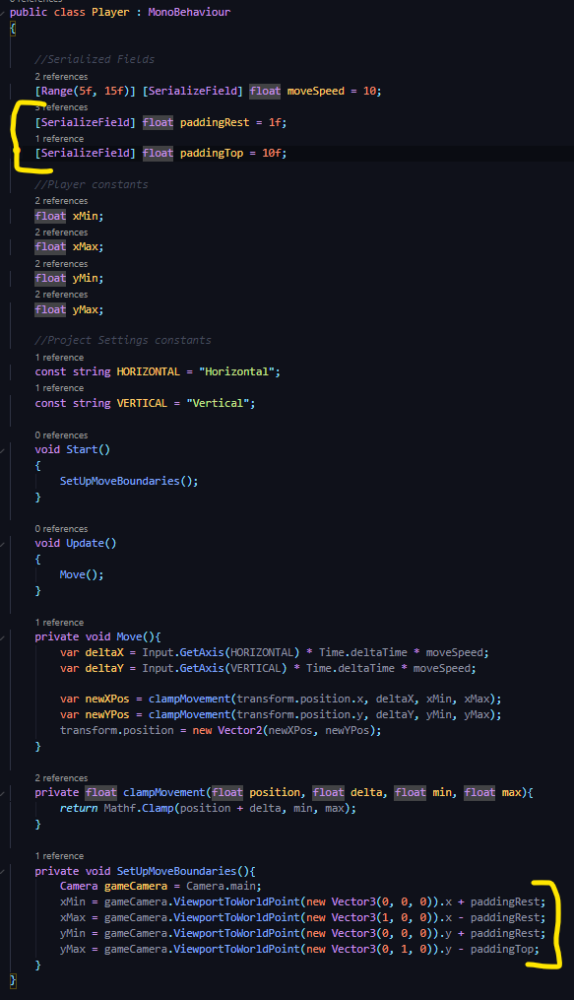

## DEV-03, ViewPort to WorldPoint:
#### Tags: [borders, padding, coordinates, ratio]

We want to prevent the ship from flying off the screen

https://docs.unity3d.com/ScriptReference/Camera.ViewportToWorldPoint.html

ViewPortToWorldPoint() converts the position of something as it relates to the camera view, into a world space value

We are setting this up so that we have the flexibility to change around our camera without having to change around some arbritrary values. 

It will all be a ratio to 1

then added some padding so that it would not hit the sides of the screen oddly

