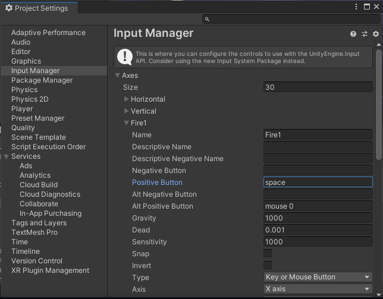
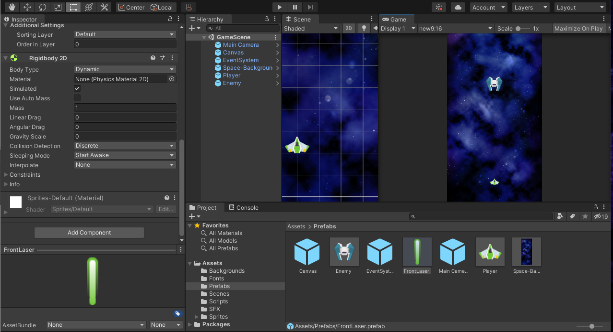
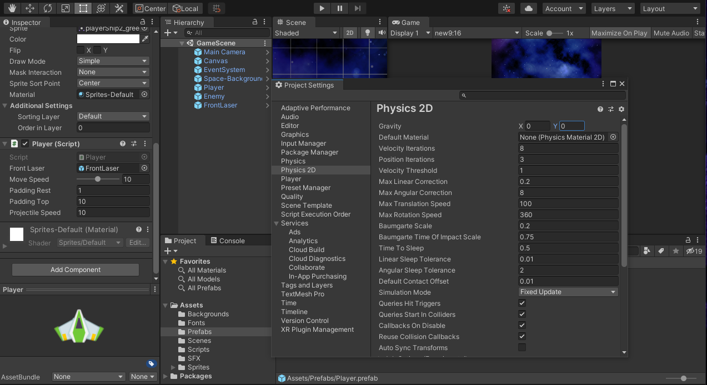

## DEV-05, Making it possible for the player to shoot:

Create a new `Laser` prefab with `Sprite Render` component with a sprite and attach this `Laser` prefab to the `Player` prefab

### How do we get a button hooked up?

Edit > Project Setting > Input Manager

Go to Fire1 and change Positive button to `space`

This instantiates the laser on the screen at the position of where the player is

Be sure imports look like this, something odd happened where VScode was importing unneeded things

What the lasers look like now, currenly they dont move

### Making Lasers move

To make it move, we need to add `Rigidbody2D` component to the laser prefab and manipulte its velocity by creating a new `Velocity2D`
Before you play, be sure to update your prefab. Updated both the `Laser` and `Player` prefab

The player is now able to shoot but `gravity` is too strong, need to make the `gravity` be 0. There are two ways to do this

### Locally change Gravity (preferred)

In the the `Laser` prefab
* put `Body Type` of  to `Dynamic`
* put `Linear Drag` to 0
* put `Angular Drag` to 0
* put `Gravity Scale` to 0

### Globally change gravity
To change gravity, go to Edit > Project Settings > Physics 2D > Gravity

* Set `Y` to 0

### Minor tweaks

Also increasing the projectile speed to 20

