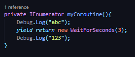
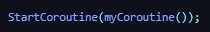

## DEV-06, using Coroutines (Theory)
#### Tags: [repeated, coroutines]

We want the player to be able to just hold down a key and have the ability to continue shooting

A Coroutine is a method which can suspend (otherwise known as yield) its execution unilt the yield instructions you gave it are met

Example when a player gets to zero health, start the KillPlayer coroutine:
+ Trigger death animation
+ Yield (wait) for 3 seconds
+ Restart the level

### Example

In DEV-07 we will be applying this to repeated fire
