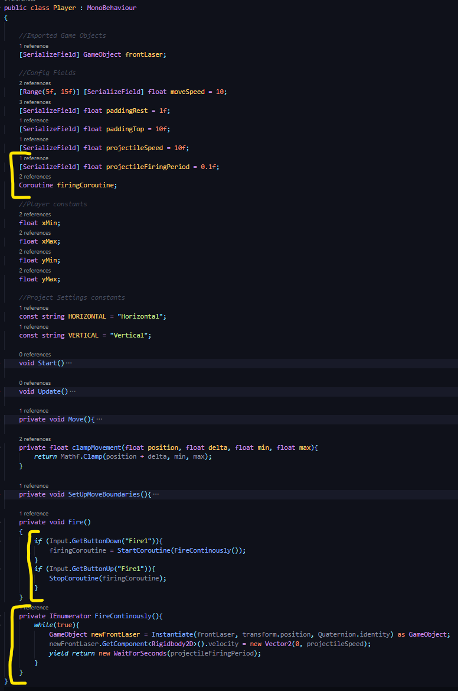
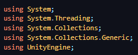
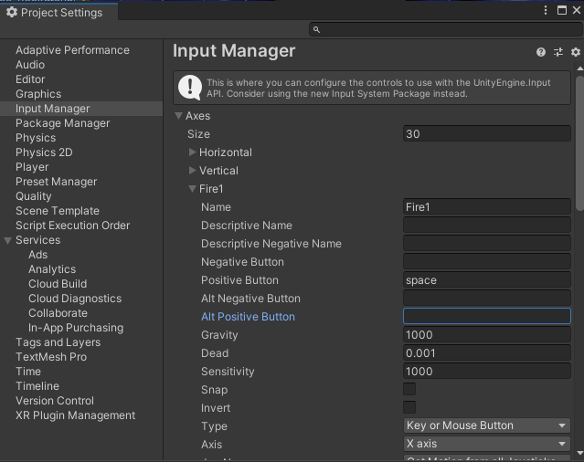

## DEV-07, using Coroutines (Implementation)
#### Tags: [repeated, coroutines, IEnumerator]

We need to make sure that we are able to 
+ start a coroutine upon button press (StartCoroutine(IEnumerator))
+ tell how frequent we want it to occur (projectileFiringPeriod)
+ tell it to repeat (while(true))
+ stop a coroutine upon button release (StopCoroutine(IEnumerator))

### Current imports

### Resolve potential bug of double input sources
make Alt Positive Button empty so that we dont have two coroutines starting on top of another

