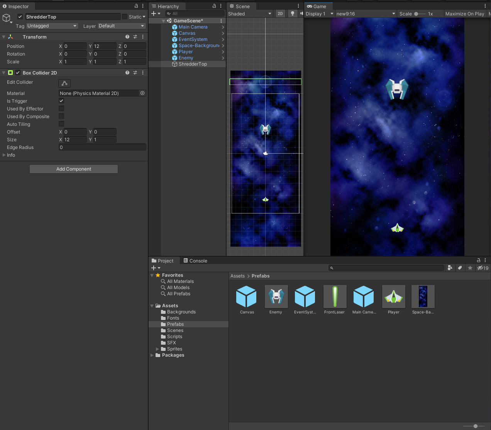
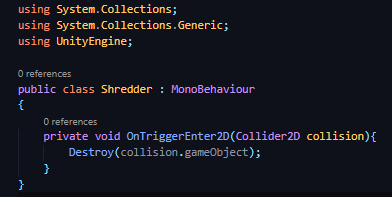
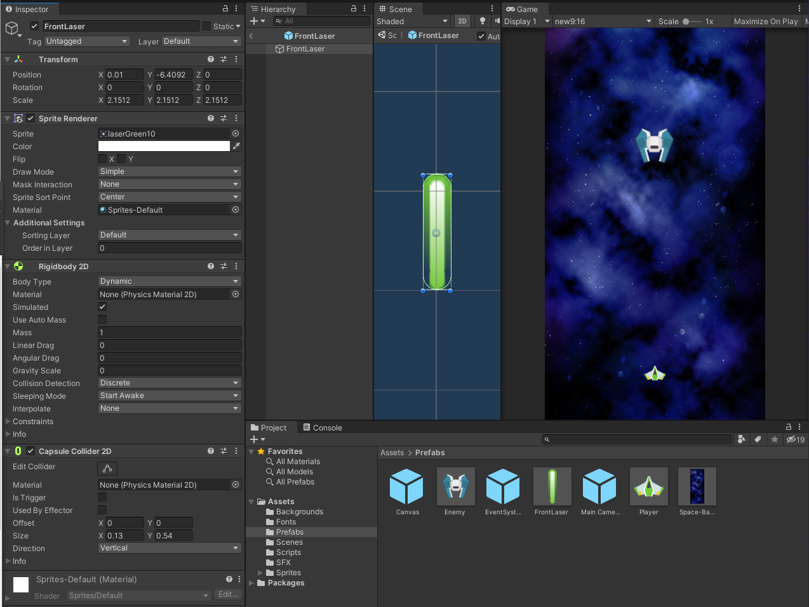

## DEV-08, GameObject Shredder
#### Tags: [trigger, destroy, collision, projectiles]

We need to make sure that we destroy the boat load of lasers that we create so that are game remains performant.

We will create a game object trigger to do this

### Creating ShredderTop GameObject

We need to: 
+ Create a new Game Object called ShredderTop
+ Add Component Box Collider 2D
+ Reset the transform
+ Set the Y to above the view of the game
+ Set the size to cover the whole top
+ Check off Is Trigger

### Creating ShredderTop Script
We need to:
+ Create an OnTriggerEnter2D function
+ Destroy object on collision

### Add Collision Component to laser
We need to:
+ Add a Capsule Collider 2D component
+ Make sure it properly covers our laser

