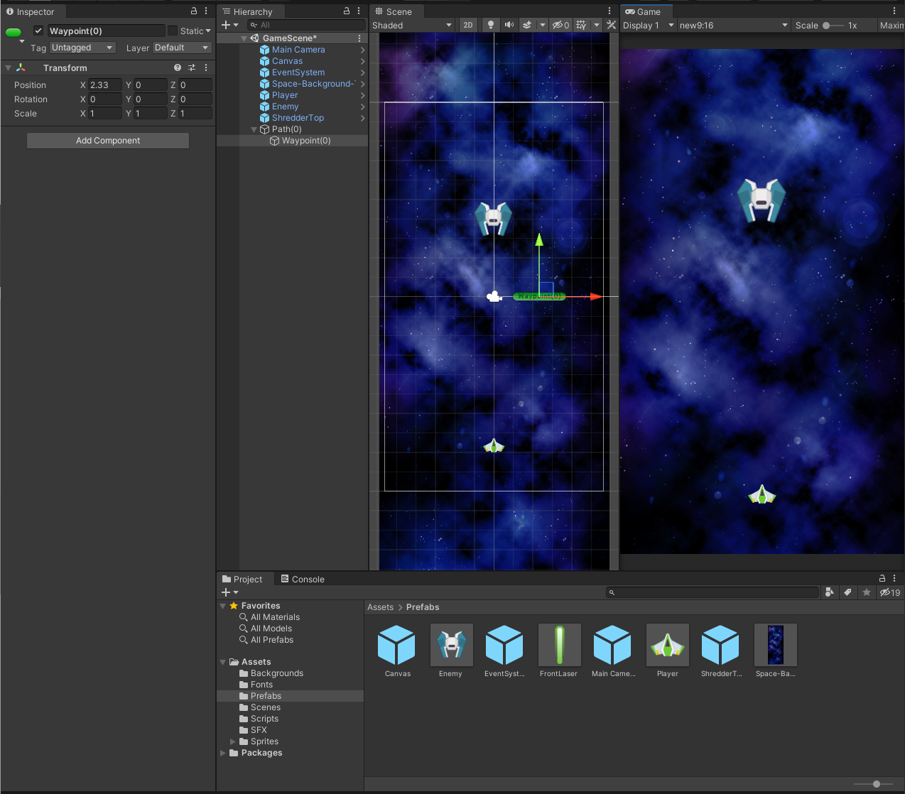
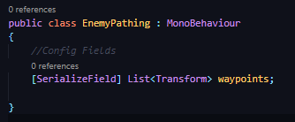
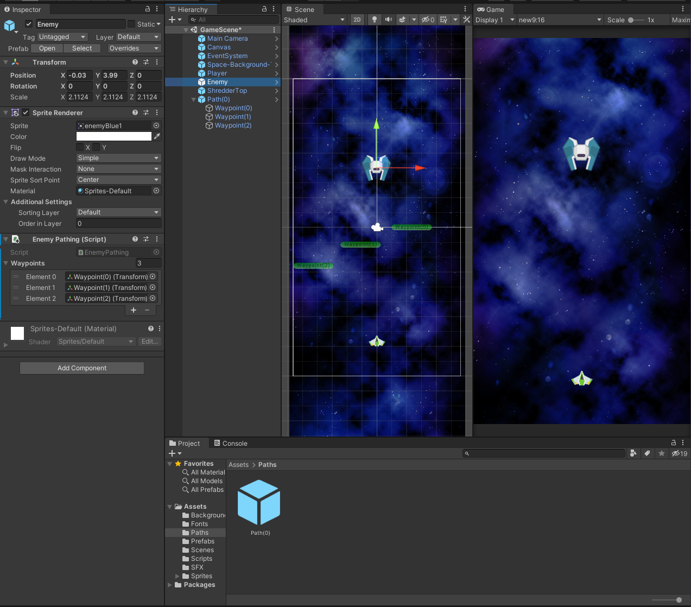

## DEV-09, Creating List of Waypoints

### What are Waypoints?

Its a way of giving entities a path to move along.
We will be creating a list which will be used to store a whole bunch of waypoints for our enemy path

### How do we make Waypoints
+ Create a GameObject and name it to `Path(0)`
+ Reset the transform
+ Right click on `Path(0)` in the Hierarchy and create a new GameObject called `Waypoint(0)`
+ Reset the transform

+ Invisible objects can be seen if you click this

+ Created a new scripot called EnemyPathing which will store an arraylist of waypoints

We are concerned with the 'where are you' of these waypoints

+ Created a new folder called paths (prefab folder for paths only)

