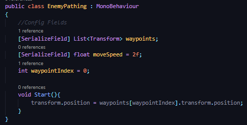
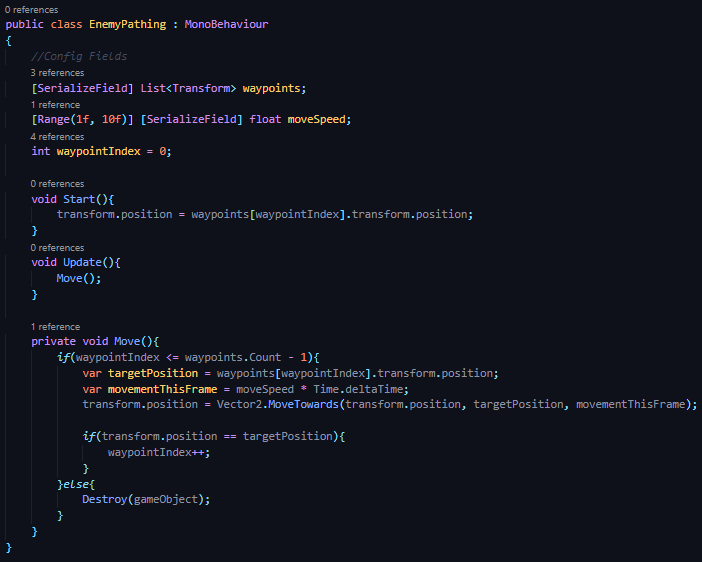

## DEV-10, Moving enemy along waypoint path
#### Tags: [pathing, destroy]
+ We are going to make are enemy move and then destroying it when it gets to our last waypoint

**Vector2.MoveTowards**
https://docs.unity3d.com/ScriptReference/Vector2.MoveTowards.html

### Code Flow
```
//if you haent reached the last waypoint then
    //MoveTowards() target waypoint
    //check if you reached the target
        //If so, increment target waypoint

//if you reached the last waypoint
    //Destroy enemy gameObject
```

+ How to grab an instance's current position:
    ```transform.position```

### How to set the position of an instance to the first waypoint


### How to move across waypoints
