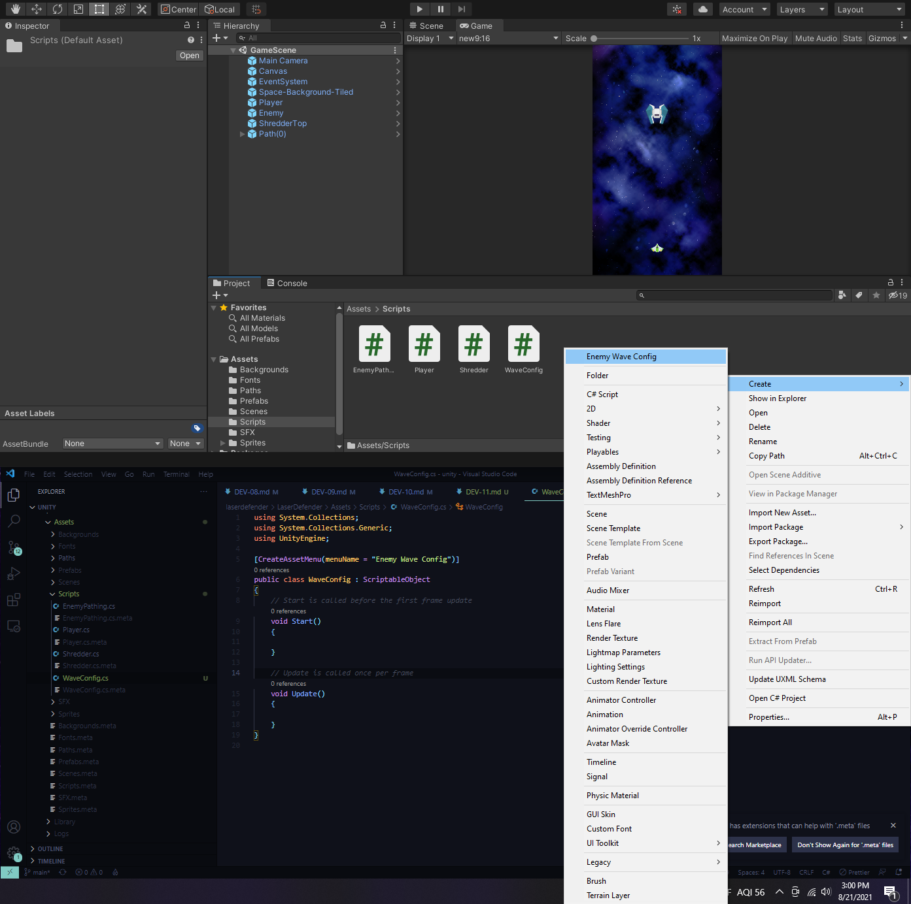
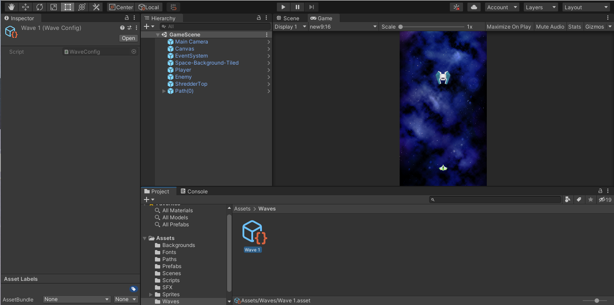
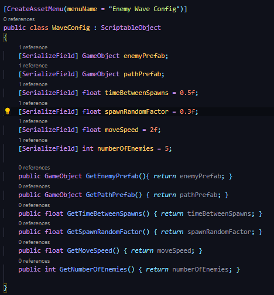
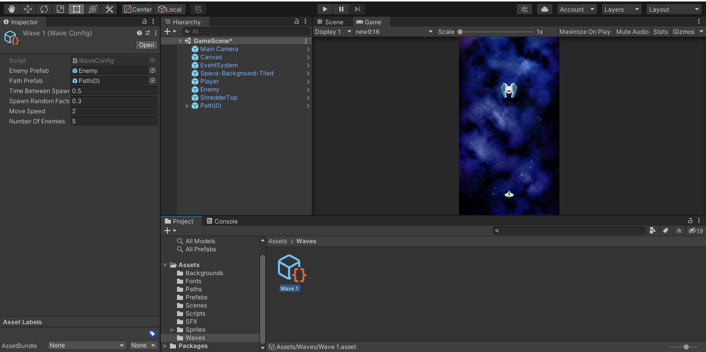

## DEV-11, Wave Scriptable Object
#### Tags: [spawning, scriptable, object]

+ Spawn X enemies that follow a path

to do this we will need 4 core tools
+ Enemy Spawner
+ Wave Config
+ Enemy Sprite
+ Enemy Pathing

In the Enemy Spawner:
+ Order of waves
+ Spawn each wave
+ Spawn each enemy in the wave

In the Enemy sprite:
+ Enemy Hp
+ Shooting behavior
+ Score for kill
+ Enemy death FX

In the Wave Config
+ Path's waypoint data
+ Enemy prefab to use
+ Spawn speed for wave
+ Number of enemies in wave
+ Movement speed of wave

Enemy Pathing
+ Move the enemy along the current path

### Creating our Scriptable Object 

Create it and rename to wave one and add to a new folder called Waves

