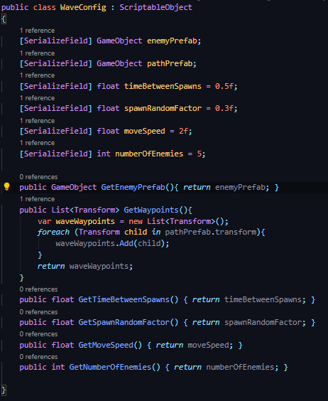
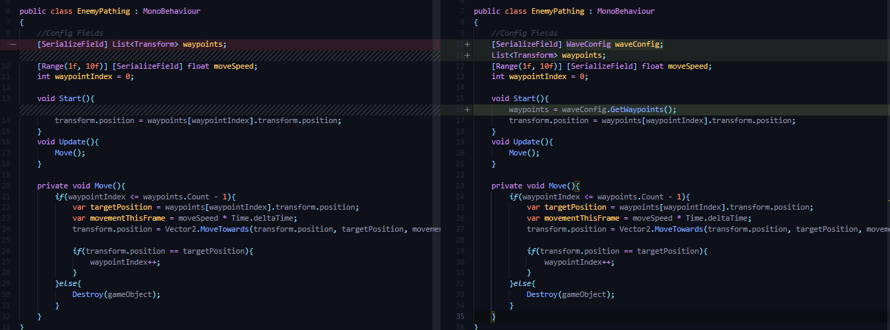
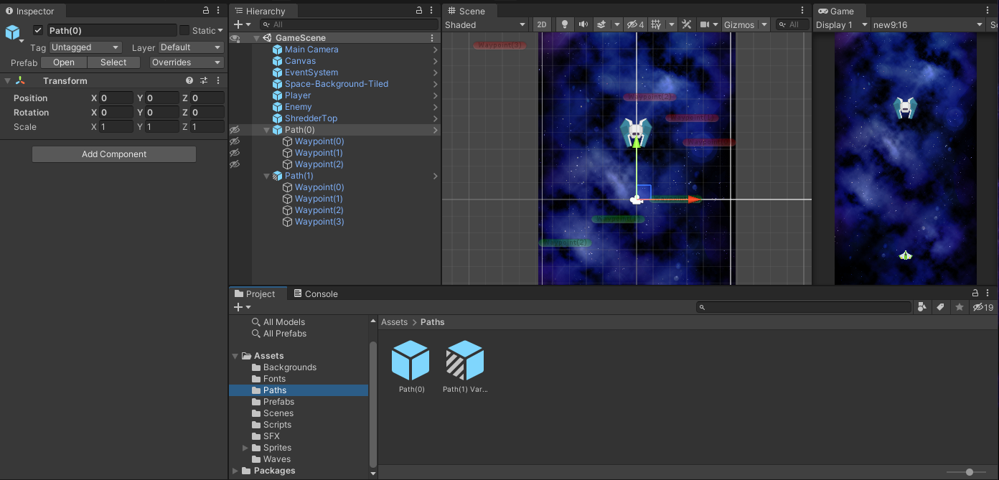
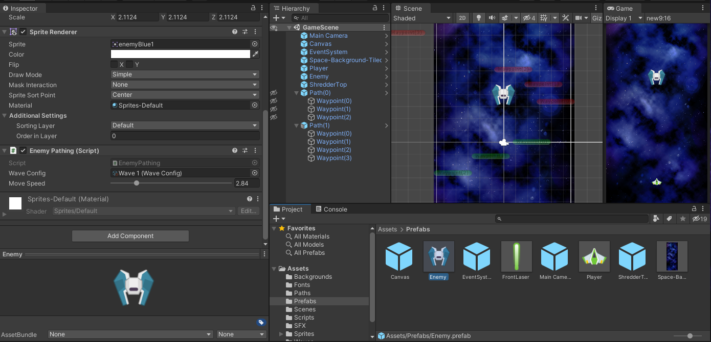

## DEV-12, Wave Scriptable Object Pt2
#### Tags: [spawning, scriptable, object]

Make sure that GetPathPrefab() returns the list waypoints and not just the path prefab.
+ reaname method GetPathPrefab() to GetWayPoints()
+ change return type to `List<Transform>`

### Able to return a list of Waypoints from a pathPrefab

### Change EnemyPathing so that no longer needs to take waypoints in one by one as a Serialized field and instead gets them from `waveConfig.GetWayPoints()`

### Create new waypoints to see if our stuff works still. we will be automating later

### Be sure that the Enemy takes in Wave Config as a serialized object

DEV-12 is a step into rearranging the delegation of responisblity within our classes so that we can eventually automate pathing