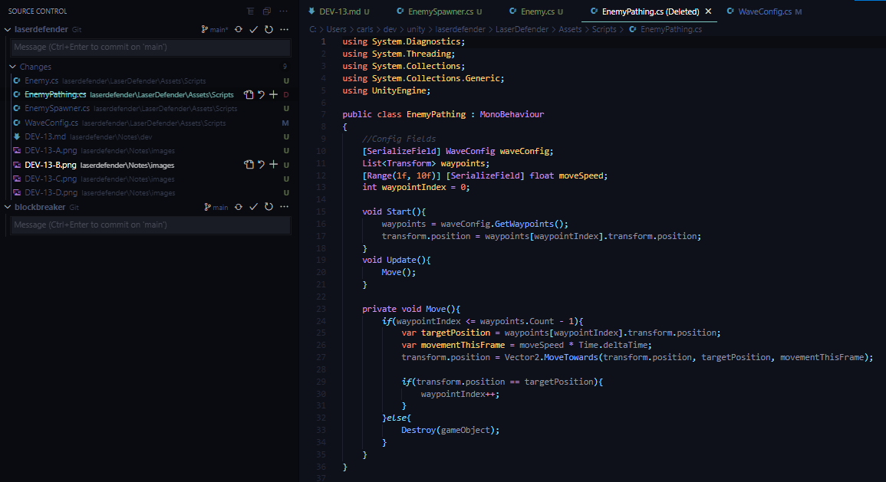

## DEV-13 (and DEV-14), Wave Scriptable Object Pt3, Spawn multiple enemies
#### Tags: [spawning, scriptable, object]

### Create a script called EnemySpawner to manage the spawn rate of enemies

Be sure to delete the Enemy Prefab that exists on the scene since it currently has its own behavior upon start up and pathing. We changed that.
We also changed the name of the enemy script from enemy pathing to enemy.

We also redid the Path(1) prefab, likely was not needed. thought there was a bug in how I set it up. But the issue was that we needed to redelegate the responsibility of Enemy managing its own movement and its own waveConfig to Enemy Spawner which will pass it a WaveConfig. these are the changes that followed:

### Rename and Edit comparison on EnemyPathing

### Now

waveconfig is no loger serialized and neither is movement speed. made a new public method so that these properties can be managed externally

### Created new Enemy Spawner class to create enemies based on the specifications of each config
