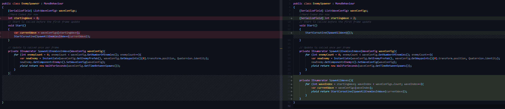
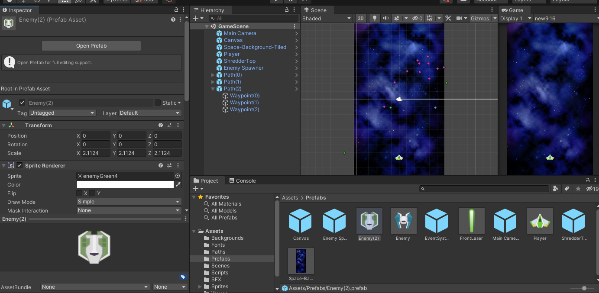
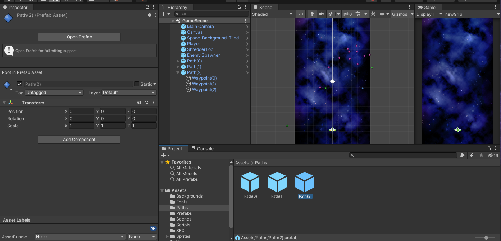
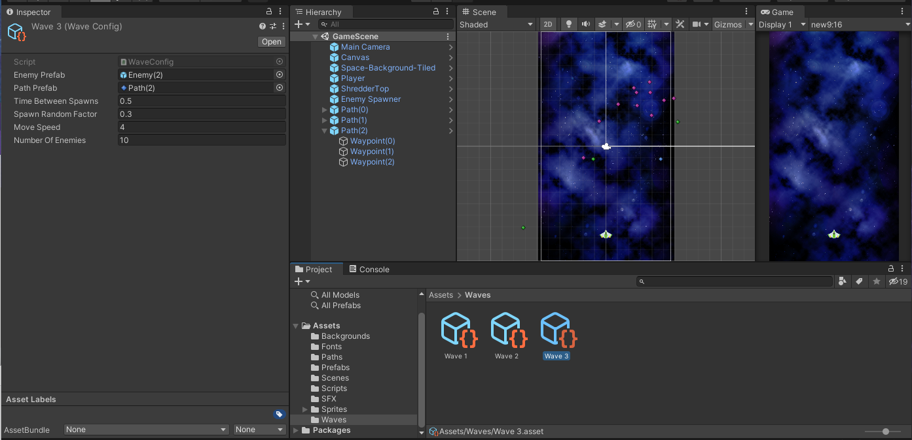
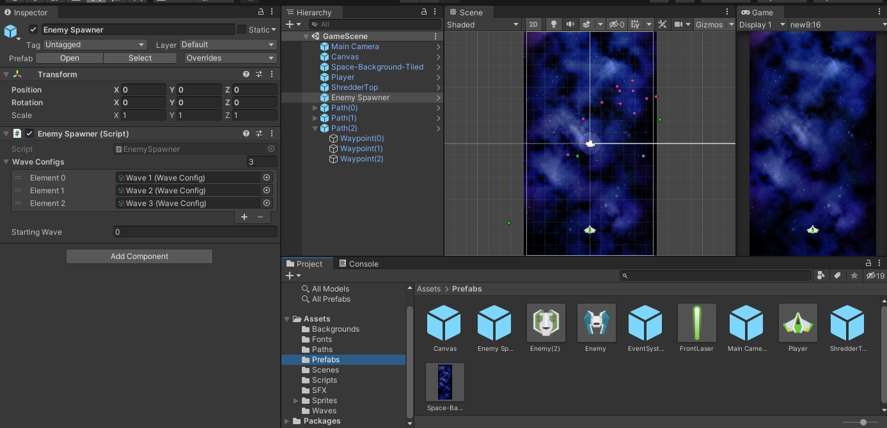

## DEV-15, Spawn Muliple Enemy Waves
#### Tags: [spawning, prefabs, coroutines]

We are going to make a spawn all waves coroutine
We learned that yield can not oly wait on seconds but on the completion of a task

## Loop the waves

## Create the enemy

## Create path

## Create the wave config

## Add the wave config to the Enemy spawners wave config list
