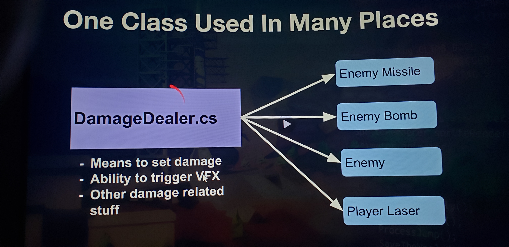
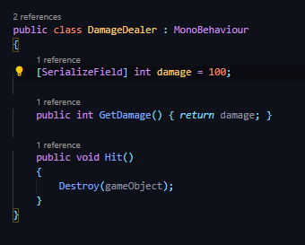
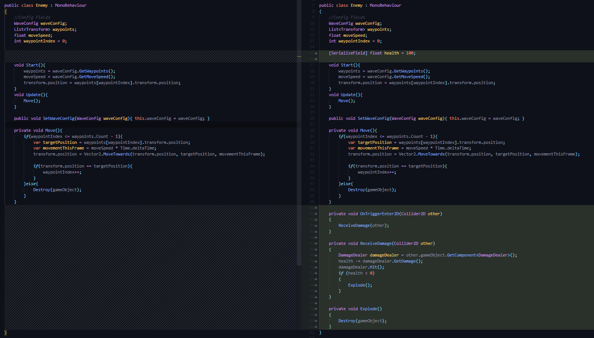

## DEV-17 (and DEV-18), make the enemy receive damage and Destroy Enemy
#### Tags: [projectiles, collision]

We created the DamageDealer class as a script to add to projectiles

Then we needed to go to unity and make sure that projectiles have isTrigger Checked

next we need to make sure that the enemy's have a response tp getting hit.
we add collition objects to the enemies on unity and then add this script behavior to lose health and die when hit

