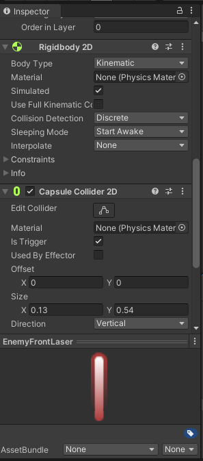

## DEV-19 Make the enemy shoot
#### Tags: [projectiles, collision, avoiding selfdamage, health, spritesize]

We want the enemy to be able to shoot
We want the shots to be random
We want the enemy to shoot its own prefab of lasers
We will create a duplicate of the green laser prefab and make a red one

So that the enemy can shoot, we created an interval of time min to max of thew space of time it will take for an enemy to shoot.
when the counter time is decided and counted down to zero, then the enemy will shoot
Wanted the enemy to avoid killing itself with its own bullets so we created names for the lasers so that it will only get hurt by green lasers

we will learn a better way to do this with layer collision matrix

We also made sure that the red lasers were a kinematic body opposed to the Dynamic body of the green laser

to increase the size of a laser you can got into the sprite mode component and manipulate the pixels per unit