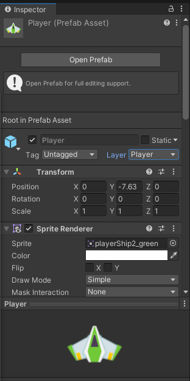

## DEV-21 Layer Collision Matrix
#### Tags: [collision]

Add collision matrix so that player and enemies dont hit themselves and dont need to check the name of the laser anymore

Edit > Project Settings > Physics 2D

We are going to create some layers

Go to player then Layer, then go to the bottom and then select Add Layer

Then we will apply the layers to the enemies and projectiles

for example, on the player

Go to the matrix and apply the relationships BE SURE THIS IS PHYSICS 2D and not PHYSICS

Delete the laser name functionality added from before, as well in player and enemy 

