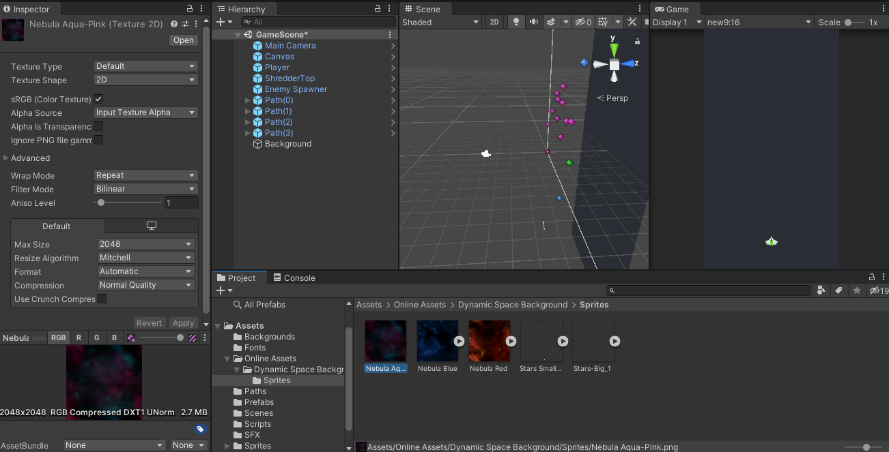

## DEV-22 Scrolling Background
#### Tags: [Backgrounds, Quads, music]

A quad is basically a flat plane that is the one side of a cube.
A quad has a propertery that will allow us to do something cool to the texture we apply to it

to create a quad right click on the scene > 3D Object > Quad

make sure it covers the space the background takes.

### Asset Store
The asset store is available online and you are able to get assets for free
make sure you are logged in to your unity account both on the asset store online and in the unity client

We are about to go from using a sprite to a texture by changing the:
`Texture Type` from `Sprite (2D and UI)` to `Default`
`Wrap Mode` from `Clamp` to `Repeat` 

Be sure in 2D mode you drage the space background over to the quad

To improve the visiblity, go to backgound (our quad) and select `Shader` and then find `Unlit > Texture`

Also Add stars which are transparent with these settings

Also added some music

Adjusted the colors of the enemies and player to match the lighting
