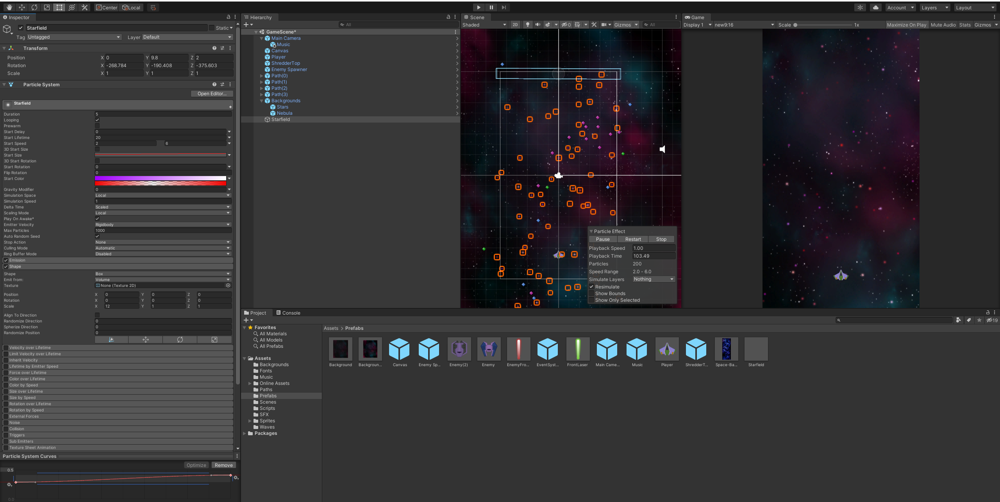

## DEV-23 Adding particle effects
#### Tags: [particles]

particals have a source which is called an emitter

create a particla field by right clicking on the hierarchy and selecting particle system

Shit is crazy and cool, honestly play around wit it. you can manage sizes, speeds and colors and do much more. I made sure that the position of the emitter was between the player and enemy and the background.