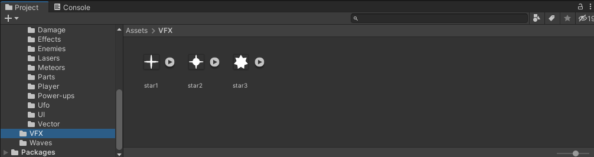
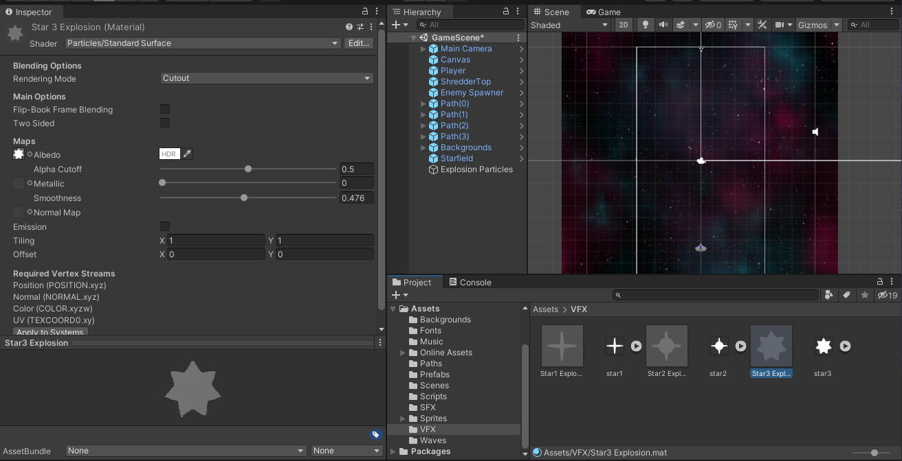
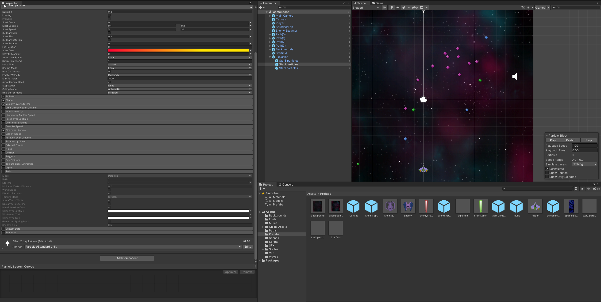
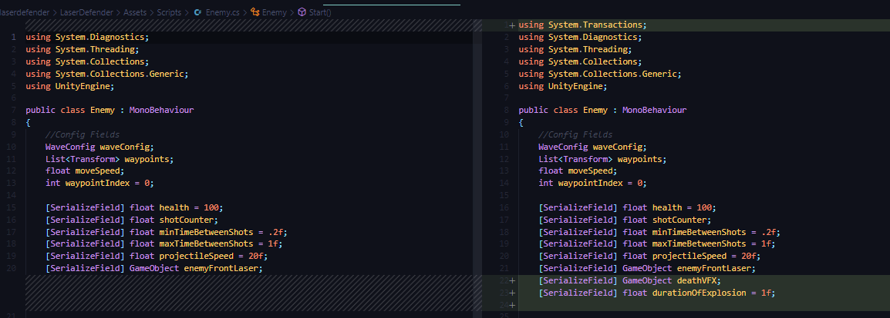
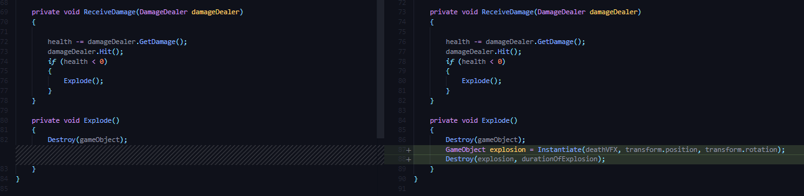

## DEV-24 Explosion particle effects
#### Tags: [particles, material, texture sheet animation module]

### Create VFX folder

### Create a Material

Right click > Create > material
set Albedo to your picture
set the shader to particles standard surface
change Rendering mode to Cutout

### Create a Particle System

Create in the hierarchy
effects > Particle System

Changed the Emission rate, shape, color, speed, lifetime, 

### Update Enemy Script

### Issues
we did not use the Texture sheet animation module for this unfortunately