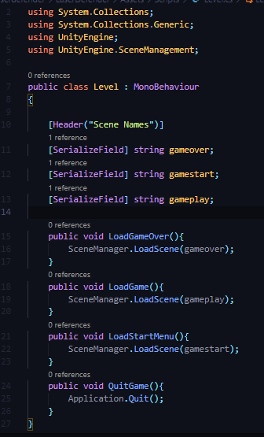
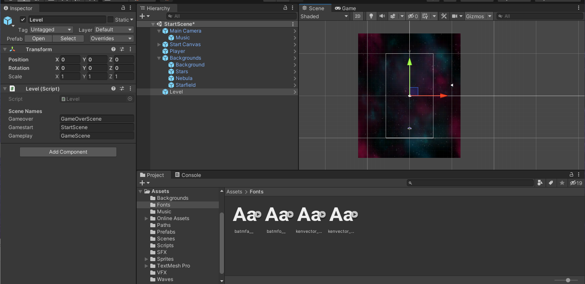
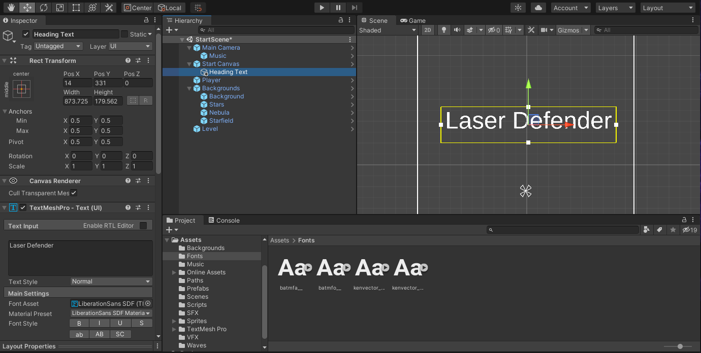
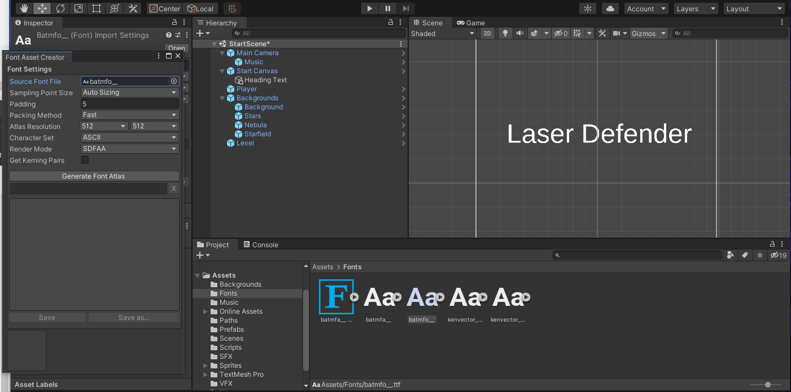
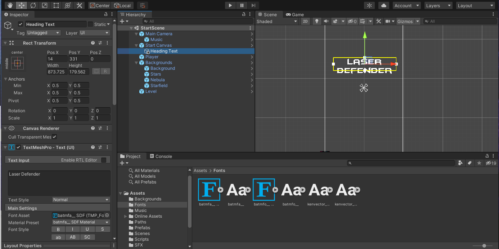
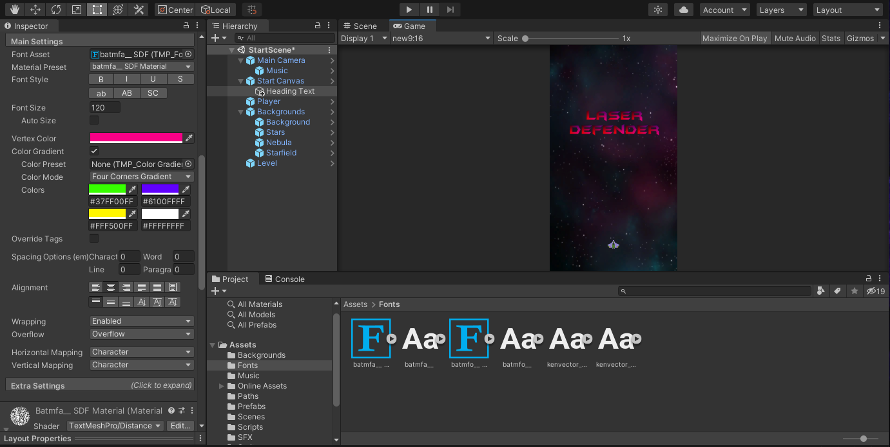
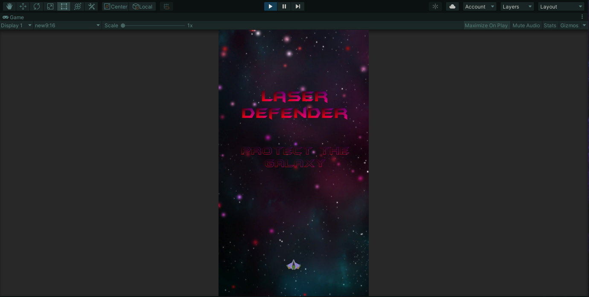
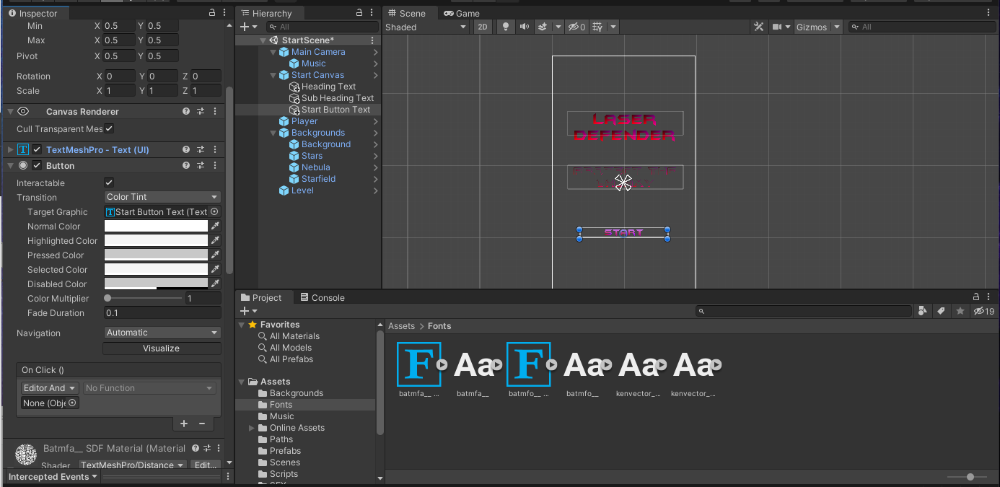
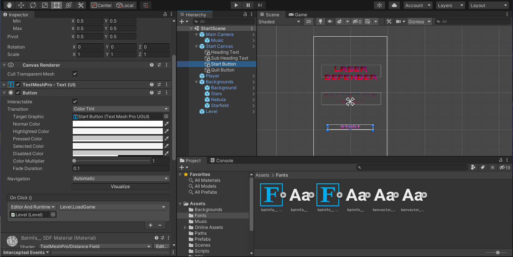

## DEV-26 Start Menu
#### Tags: [scenes, buttons, BreakPrefab Instance, fonts, textmeshpro]

### Create a level script

### Create a start scene

`right click on instance > prefab > unpack prefab`

to create a original copy ofd a prefab for the canvas

### Creating fonts

We will also import som text mesh pro fonts

We will ned to convert our batman forever fonts into text mes pro fonts

`Window > TextMeshPro > Font Asset Creator > Drag Drop font > Generate Font Atlas > Save As`

In heading text, replace `Font Asset` with the newly created font assets

Add in some color

Apply the second font

### Creating Buttons

Add a button component to a new texMeshPro text

drag the level game object into it
Be sure to select load game

Do the same for Quit functionality

For buttons to work, be sure that there is an eevent system in the hierarchy