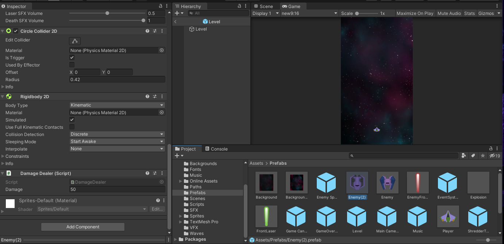

## DEV-27 Delay between switching scenes
#### Tags: [scenes, delay, ridgidbody]

### RidgidBody2D stuff

Made the enemies in way so you get hurt when you touch them

Also added some null check precautions incase object is null

### Scene Delay

Made sure that we added a coroutine to make the game over load after two seconds upon player death

