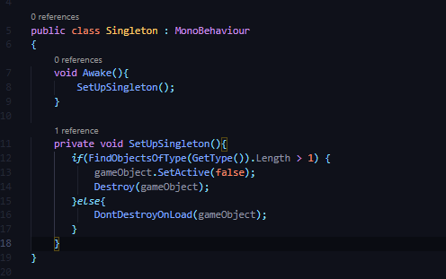
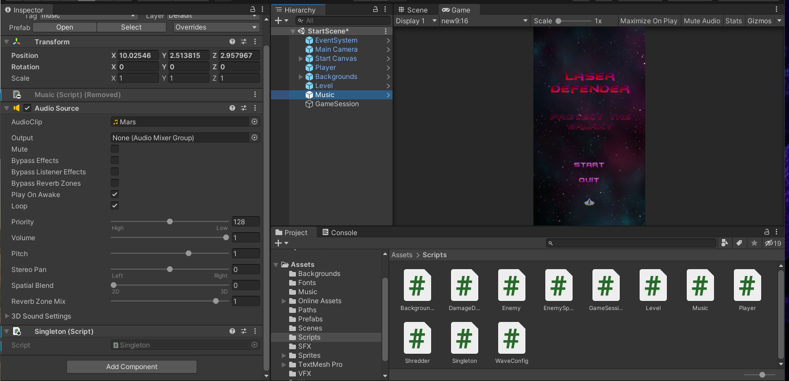
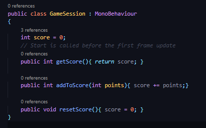

## DEV-29, Create a score board
#### Tags: [singleton, scoring, FindObjectOfType, singleton, text]

### Repurpose Music singleton behavior (NOT GOOD IDEA)

(music needs the singleton class but others like gamesession dont, they need their own)

Be its own stand alone class

Replace the script in all scenes, prefabs can have more than one script

### Create a GameSession prefab to keep score

Create a game object and a script for GameSession and apply the singleton script as well

if you are working with text, be sure to add `UnityEngine.UI` on top

look at the commit for this one, far too many changes across files

also added a new wave
