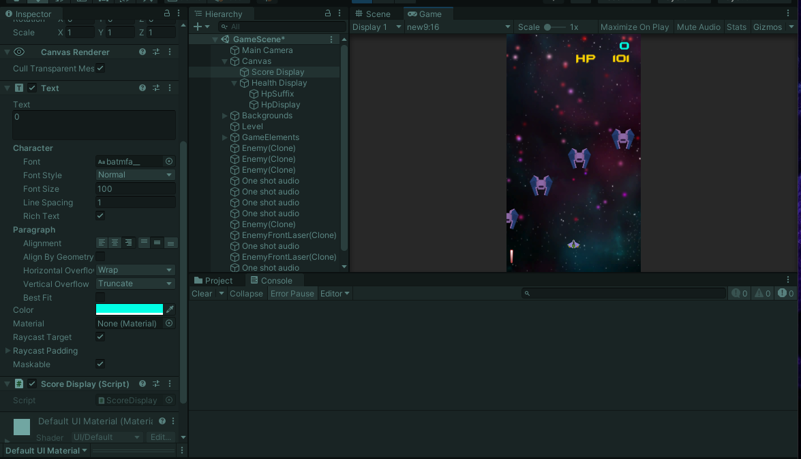
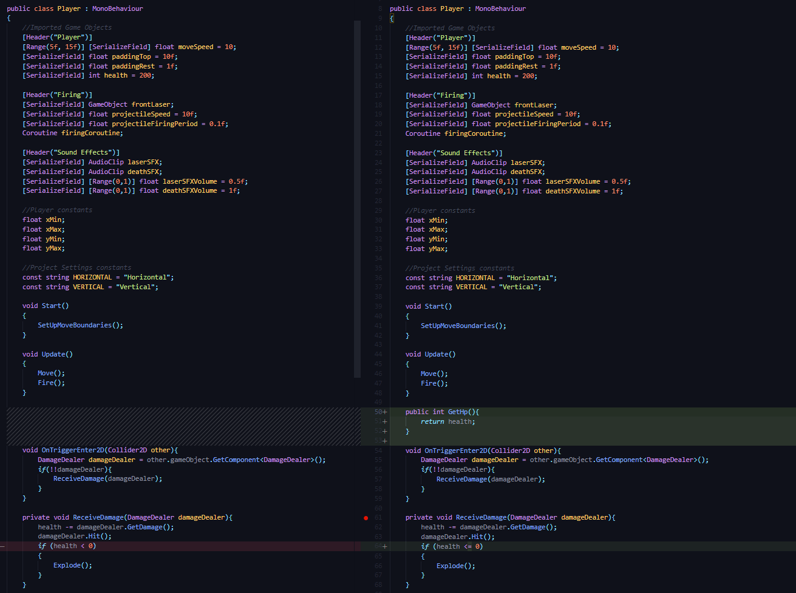
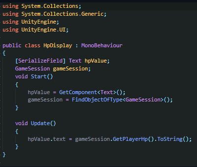

## DEV-30, Display Player Health
#### Tags: [singleton, scoring, FindObjectOfType, singleton, text]

Refer to DEV-29 for more complete explaination on how to do this, nearly the same.

Also fuck PascalCase